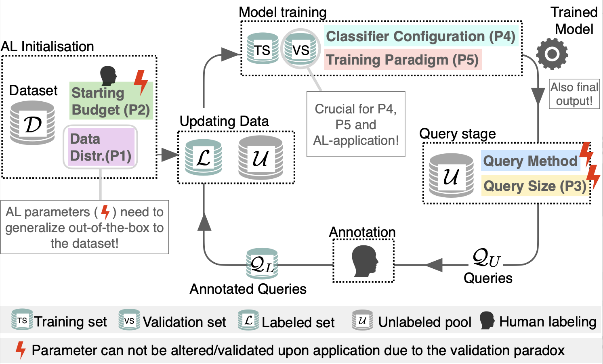

<!-- # Active-Study -->

# Realistic-AL
<p align="">
    <!--  -->
    <a href="https://github.com/IML-DKFZ/realistic-al/blob/main/LICENSE">
    
    </a>
    <!-- <a href="https://github.com/IML-DKFZ/fd-shifts/releases">
        
    </a>
    <a href="https://zenodo.org/badge/latestdoi/570145779"></a> -->
</p>

##  *Navigating the Pitfalls of Active Learning Evaluation: A Systematic Framework for Meaningful Performance Assessment*
#### Official Benchmark Implementation


### <a id="Abstract"></a> :books: Abstract
> Active Learning (AL) aims to reduce the labeling burden by interactively selecting the most informative samples from a pool of unlabeled data. While there has been extensive research on improving AL query methods in recent years, some studies have questioned the effectiveness of AL compared to emerging paradigms such as semi-supervised (Semi-SL) and self-supervised learning (Self-SL), or a simple optimization of classifier configurations. Thus, today’s AL literature presents an inconsistent and contradictory landscape, leaving practitioners uncertain about whether and how to use AL in their tasks. In this work, we make the case that this inconsistency arises from a lack of systematic and realistic evaluation of AL methods. Specifically, we identify five key pitfalls in the current literature that reflect the delicate considerations required for AL evaluation. Further, we present an evaluation framework that overcomes these pitfalls and thus enables meaningful statements about the performance of AL methods. To demonstrate the relevance of our protocol, we present a large-scale empirical study and benchmark for image classification spanning various data sets, query methods, AL settings, and training paradigms. Our findings clarify the inconsistent picture in the literature and enable us to give hands-on recommendations for practitioners.

<p align="center">
    <figure class="image">
        
        <figcaption style="font-size: small;">
        <!-- There is no consensus regarding the performance gain of AL methods over random sampling in the literature, especially with regard to the cold start problem and orthogonal developments s.a. self-supervised and semi-supervised learning.  -->
        As practitioners need to rely on the performance gains estimated in studies to make an informed choice whether to employ AL or not, as an evaluation would require additional label effort which defeats the purpose of using AL (validation paradox).
        Therefore the evaluation needs to test AL methods with regard to the following requirements: 1) Generalization across varying data distributions, 2) robustness with regard to design choices of an AL pipeline 3), performance gains persist in combination with orthogonal approaches (e.g. Self-SL, Semi-SL).<br>
		This benchmark aims at solving these issues by improving the evaluation upon 5 concrete pitfalls (P1-P5) in the literature (shown in action the figure above): <br>
        P1: Lack of evaluated data distribution settings. 
        P2: Lack of evaluated starting budgets.
        P3: Lack of evaluated query sizes.
        P4: Neglection of classifier configuration.
        P5: Neglection of alternative training paradigms.
        </figcaption>
    </figure>
</p>

## <a id="Citing"></a>:scroll: Citing This Work

If you use Realistic-AL, please cite our [paper](https://arxiv.org/abs/2301.10625)

```bibtex
@inproceedings{
luth2023navigating,
title={Navigating the Pitfalls of Active Learning Evaluation: A Systematic Framework for Meaningful Performance Assessment},
author={Carsten Tim L{\"u}th and Till J. Bungert and Lukas Klein and Paul F Jaeger},
booktitle={Thirty-seventh Conference on Neural Information Processing Systems},
year={2023},
url={https://openreview.net/forum?id=Dqn715Txgl}
}
```

## <a id="ToC"></a> :pushpin: Table Of Contents

- [Realistic-AL](#realistic-al)
  - [:books: Abstract](#Abstract)
- [:scroll: Citing This Work](#Citing)
- [:pushpin: Table Of Contents](#ToC)
- [:wrench: Installation](#Installation)
- [:open_file_folder: Project Structure](#Structure)
- [:rocket: Usage](#Usage)
  - [Set up of the environment variables](#set-up-of-the-environment-variables)
  - [Running Experiments](#running-experiments)
  - [Analysis](#analysis)
- [:hammer: Integrating Integrate Your own Query Methods, Datasets, Trainings & Models](#Integrating)
- [Acknowledgements](#acknowledgements)

## <a id="Installation"></a> :wrench: Installation

**Realistic-AL requires Python version 3.8.** It is recommended to
install Realistic-AL in its own environment (venv, conda environment, ...).

1. **Install an appropriate version of [PyTorch](https://pytorch.org/).** Check
   that CUDA is available and that the CUDA toolkit version is compatible with
   your hardware. The currently necessary version of
   [pytorch is v.1.12.0](https://pytorch.org/get-started/previous-versions/#v1120).
   Testing and Development was done with the pytorch version using CUDA 11.3.

2. **Install Realistic-AL.** This will pull in all dependencies including some
   version of PyTorch, it is strongly recommended that you install a compatible
   version of PyTorch beforehand.
   ```bash
   pip install -e '.[dev]'
   ```

## <a id="Structure"></a> :open_file_folder: Project Structure 
```
├── analysis                # analysis & notebooks
│   └── plots                   # plots
├── launchers               # launchers for experiments
├── ssl                     # simclr training 
│   └── config                  # configs for simclr
└── src                     # main project
    ├── config                  # configs for main experiments
    ├── data                    # everything data
    ├── models                  # pl.Lightning models 
    │   ├── callbacks               # lightning callbacks
    │   └── networks                # model architecture
    ├── plotlib                 # scripts for plotting
    ├── query                   # query method
    │   └── batchbald_redux         # batchbald implementation from BlackHC
    ├── test                    # tests
    └── utils                   # utility functions
```

## <a id="Usage"></a> :rocket: Usage

To use `Realistic-AL` you need to:
1. set two environment variables described below
2. you may have to go through the code and change global variables which are highlighted with ### RUNNING ###

Set up of the environment variables.

```bash
export EXPERIMENT_ROOT=/absolute/path/to/your/experiments
export DATA_ROOT=/absolute/path/to/datasets
```

Alternatively, you may write them to a file and source that before running
`Realistic-AL`, e.g.

```bash
mv example.env .env
```

Then edit `.env` to your needs and run

```bash
source .env
```


### Running Experiments
The experiment running is handled via the experiment launcher with specific files in `/launchers/{}.py`.

More info can be found [here](launchers/README.md)


### Analysis
The implemented analysis can be found in the folder `/analysis/` and consists of:
1. Standard performance vs. labeled data plots
2. Area Under Budget Curve (AUBC)
3. Pairwise Penalty Matrices (PPM)

More info about the analysis can be found [here](analysis/README.md)


## <a id="Integrating"></a> :hammer: Integrating Integrate Your own Query Methods, Datasets, Trainings & Models

Query methods, baselines and datasets can be integrated into Realistic-AL allowing for simplified benchmarks.

More information can be found [here](docs/integration.md)

## Acknowledgements

<p align="center">
   &nbsp;&nbsp;&nbsp;&nbsp;
   &nbsp;&nbsp;&nbsp;&nbsp;
  
</p>

Realistic-AL is developed and maintained by the [Interactive Machine Learning Group](https://iml-dkfz.github.io) of [Helmholtz Imaging](https://helmholtz-imaging.de) and the [DKFZ](https://www.dkfz.de/en/index.html). 
